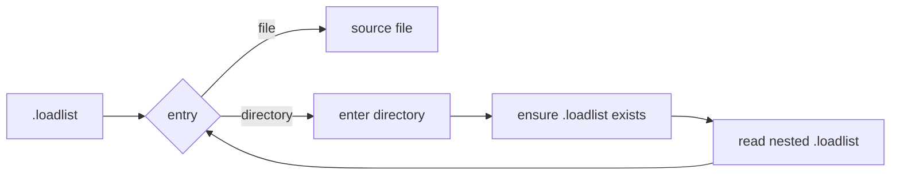
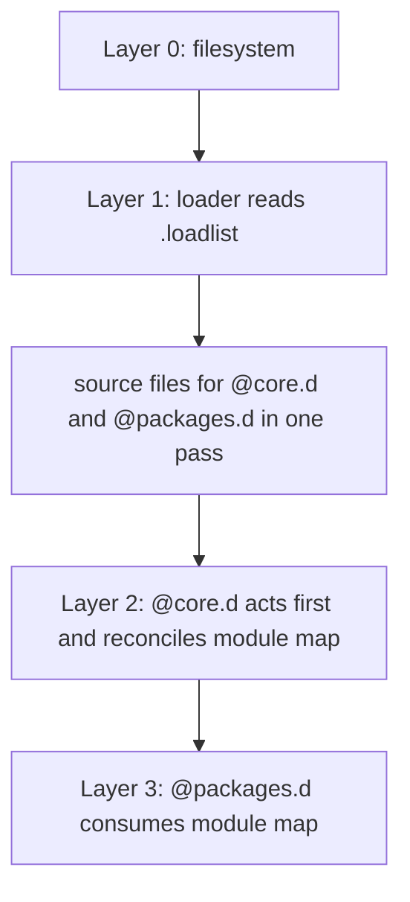

# MODULES — Loader, Module, and Submodule Semantics

> **Status:** Specification (pre-implementation).
> **Scope:** Defines loader-facing module semantics, submodule identity, the `.d`-suffix convention inside `@core.d`, and the reconciliation model by which `@core.d` produces the module map.
> **Relationship to other docs:** [`ARCHITECTURE.md`](../spec/ARCHITECTURE.md) is the integrating overview. [`PACKAGES.md`](../spec/PACKAGES.md) consumes the module map defined here for projection, reverse-projection, lifecycle, facets, and consolidation.
> **Relationship to prior docs:** This document integrates material from the original `MODULES.md`, which has since been superseded.

**Implementation note.** This spec names the core package `packages.d/@core.d/` and the package manager `packages.d/@core.d/@packages.d/` to make the module-correspondent convention explicit. The live tree may still use `packages.d/@core/` and `packages.d/@core/@packages/` until that rename happens. Semantics are as described here.

-----

## 1. Place in the Stack

This document explains how rings gets from ordinary directories and `.loadlist` files to the idea of modules.

- The filesystem contains files, directories, and symlinks, but does not by itself define modules or packages.
- The loader reads `.loadlist`, resolves entries, sources files, and recurses into directories.
- `@core.d` decides which directories count as modules and submodules.
- `@packages.d` uses that module map for package operations.

This dependency exists only at the semantic layer. `@packages.d` depends on the module map produced by `@core.d`, but the loader (and of course, the filesystem) do not depend on either higher layer.

-----

## 2. The Loader Layer

The loader (`zload` / `bload`) is simple. It follows `.loadlist`. It does not decide what counts as a module or a package.

At a high level, the loader:

- reads `.loadlist`
- resolves each entry to a filesystem path
- sources files
- recurses into directories
- ensures a `.loadlist` exists when recursing into a directory



This document does not define the loader's full regex grammar or option set. It defines how higher layers interpret the structure the loader loads.

### 2.1 Entry Types

The loader already accepts and recurses into both of the directory forms that matter here:

- `*.d/` directories
- `@name/` scopes

The loader by itself does not assign different meanings to those two forms. It only checks whether the resolved path is a file or a directory. The distinction is introduced by `@core.d` and `@packages.d`, which interpret the @-prefixed and -.d suffixed directories.

### 2.2 `.loadlist` as a Record

A `*.d/` directory that has been entered by the loader will have a `.loadlist`, because the loader creates one if needed when it enters a directory. In practice, this makes `dir/.loadlist` a useful and cheap record that the directory has been declared into the loader tree.

The actual declaration is the parent's `.loadlist` entry. The nested `.loadlist` is the durable trace of that declaration.

-----

## 3. What a Module Is

A **module** is a top-level `*.d/` directory in `$PROFILE_D`. A **submodule** is a `*.d/` directory directly inside a module or another submodule.

Examples:

- `env.d/` is a top-level module
- `env.d/secrets.d/` is a submodule
- `aliases.d/extra.d/` is a submodule

In practice, rings uses this rubric:

- A top level `*.d/` directory is a module
- A  `*.d/` is a submodule if its parents are either a module or another submodule.
- If inconsistent with `@core.d` immediate children, it prompts the user to adopt and reconcile these module.d/submodule.d's as @core.d/@module.d/@submodule.d in its own hierarchy.

### 3.1 Module Children

A module's `.loadlist` may contain:

- `name.d/` — a submodule
- `@name/` — a package scope
- `file.sh` / `file.zsh` / dotfiles — any sourceable files

All three may coexist at any depth. Submodules and packages are not mutually exclusive inside a module.

### 3.2 The One-Way Boundary

Module-space and package-space are distinct semantic domains:

- In module-space, `*.d/` means module or submodule.
- In package-space, an @-prefixed `*.d/` means payload-type routing inside a package, a concern of @core.d/@packages.d, not @core.d.

No layer enforces this boundary by force. It exists because each layer looks for different things:

- the loader recurses into whatever it is told to recurse into
- `@core.d` looks for modules in the top level module-space to compare against its own congruently named children.
- `@packages.d` looks for packages in inner package-space and then deeper for un @-prefixed projection targets (*.d's) in the module map

Higher layers warn if a user intentionally crosses the boundary or conflicts with reconciliation or normalization.

-----

## 4. `@core.d` and the Module Map

`@core.d` is the part of rings that decides which directories count as modules. It itself lives in packages.d, however packages.d has no notion of itself beinga module without `@core.d`.

`@core.d` first identifies itself with `$PROFILE_D` -- identifying its children with the top level modules of `$PROFILE_D`. This means:

- top-level `@*.d/` children of `@core.d` correspond to top-level `*.d/` directories in `$PROFILE_D`
- nested `@*.d/` children beneath those correspond to nested `*.d/` submodules recursively
- the first `@` child without a `.d` suffix is the package boundary

> Example: In `@core.d`, a top-level child named `@name.d/` would thus correspond. to a top-level module `name.d/` in `$PROFILE_D`.
> Nested `@*.d/` children continue that correspondence recursively and define submodules. The first `@` child without a `.d` suffix (indicating no module-hood) ends the inference chain.

As a result, `@core.d` therefore reconciles the **module map**, that is post-reconiliation, the *.d suffixed diretories and subdirectories directly within `rings` are now considered canonical modules of `$PROFILE_D.` and simultaneously @-prefixed and*.d suffixed directories of `@core`. `@packages.d` is thereby enabled to consider the resulting post-reconciliation *.d suffixed diretories and subdirectories as modules adjuicated by @core.

<!--- Define projection non-jargonistically before this> -->
### 4.1 Outward Projection

`@core.d` scans its own tree in `packages.d/@core.d/`.

For each `@*.d/` child:

- if the corresponding `*.d/` exists in `$PROFILE_D`, the mapping is confirmed
- if it does not exist, `@core.d` prompts the user if they'd like to create the module.

Distinguish `actual module`--unprefixed top level `*.d/` in `$PROFILE_D` from `correspondent package`: the @-prefixed, *.d-suffixd children of `@core`.

<!--- Define enrichment non-jargonistically before this> -->
<!--- Define projection non-jargonistically before this> -->
<!--- Define cross-projection non-jargonistically before this> -->
- `@core.d` enriches each actual module with its hidden cross-projections
- the process recurses into nested `@*.d/` children
- sibling

### 4.2 Inward Adoption

`@core.d` also scans `$PROFILE_D` for `*.d/` directories and nested `*.d/` submodules.

For each such suffixed-directory:

- if a corresponding `@core.d/.../@name.d/` path already exists, the two are identified with each other, and it continues.
- if not, `@core.d` may propose adoption so the user can decide whether that directory should enter the canonical module map (have the corresponding directories created).

These two scans are meant to converge such that after reconciliation, `@core.d`'s suffixed-and-prefixed `@*.d` hierarchy and `$PROFILE_D`'s `*.d/` suffixed-only hierarchy mirror one another, with user-defined exceptions.

-----

## 5. The `.d`-Suffix Convention Inside `@core.d`

Inside package-space, `@`-prefixed names normally mean packages. But `@core.d` also needs to describe module hierarchy inside its own `@`-only namespace. The `.d` suffix on an `@`-prefixed name is the signal it uses.

**Rule.** Within `@core.d`:

- `@name.d/` means a package-space name that stands for a module in `$PROFILE_D`
- `@name/` means ordinary package scope with no module correspondence

`@packages.d` ignores the distinction. To `@packages.d`, `@env.d` and `@formatting` are both equally packages.

```text
packages.d/@core.d/
├── @env.d/                  -> env.d/
├── @aliases.d/              -> aliases.d/
├── @functions.d/            -> functions.d/
├── @packages.d/             -> packages.d/
├── @help.d/                 -> help.d/
└── @formatting/             -> package only; no module correspondence
```

This also handles nested module depth cleanly:

- `@core.d/@env.d/@secrets.d/@vault/` corresponds to env.d/secrets.d/@vault
- `@core.d/@env.d/@secrets.d/@deep.d/@vault/` means three module levels, then a package: env.d/secrets.d/deep.d/@vault

The chain of `.d`-suffixed names is the module chain.

-----

## 6. Submodules

Submodules loading is inherently supported by the loader's recurisve matchinag and loading semantics.

Examples present in the live tree include:

- `aliases.d/extra.d/`
- `completions.d/hooks.d/`
- `env.d/color.d/`
- `init.d/autoload.d/`
- `init.d/make.d/`
- `install.d/make.d/`
- `install.d/update.d/`
- `plugins.d/history.d/`

`@core.d` represents those submodules with nested `@*.d/` descendants inside its own tree.

```text
packages.d/@core.d/
├── @env.d/
│   ├── @secrets.d/
│   │   └── @vault/
│   └── @color/
├── @aliases.d/
│   ├── @extra.d/
│   └── @bash/
└── @functions.d/
```

The first `@` child without a `.d` suffix is not a submodule. It is a package inside that module's space.

-----

## 7. Bootstrap and Action Order

The loader performs a single traversal of loadlists. In that same traversal it sources the code that defines both `@core.d` and `@packages.d`.

What differs is when they act, not when they are loaded.



The sequence is:

1. the loader makes the relevant code available in the running shell
2. `@core.d` acts first and establishes or reconciles the module map
3. `@packages.d` acts afterward and uses that map to interpret payload routing

`@packages.d` depend on `@core.d` semantically as it considers itself to be a subpackage of @core.d which it considers a proper package.

-----

## 8. Modules Bundled with `@core.d`

We include a default set of top-level module subpackages 9f `@core.d`. They are not distinguished from user-created modules in semantics. They provide `rings` core, but not essential user functionality.

The current live top-level module set includes:

- `aliases.d/`
- `comm.d/`
- `completions.d/`
- `config.d/`
- `database.d/`
- `env.d/`
- `functions.d/`
- `help.d/`
- `init.d/`
- `install.d/`
- `kbd.d/`
- `network.d/`
- `options.d/`
- `packages.d/`
- `paths.d/`
- `plugins.d/`
- `preferences.d/`
- `prompts.d/`
- `venvs.d/`

New top-level modules, as defined by the user / discovered by @core.d in $PROFILE.D/ can be adopted into `@core.d`, if the user accepts.
New submodules can be added beneath existing ones <!-- describe the syntax -->.

### 8.1 Functional Summary

The bundled set currently covers (for Bash & Zsh)

- shell boot and runtime state: `paths.d/`, `options.d/`, `env.d/`, `venvs.d/`
- interactive shell surface: `functions.d/`, `aliases.d/`, `completions.d/`, `plugins.d/`, `prompts.d/`, `kbd.d/`
- package and configuration lifecycle: `config.d/`, `init.d/`, `install.d/`, `packages.d/`
- integrated self-documentation `help.d/`
- OS-related modules currently present in the live tree: `comm.d/`, `database.d/`, `network.d/`, `preferences.d/`

This list described @core.``d as-is, but doesnt not contract or hardcode the architecture. Module identity ultimately comes from the `@core.d` correspondence model and interactive reconciliation with the user.

-----

## 9. Invariants

These govern the module layer.

1. **`@core.d` decides module identity.** No other component creates, removes, or reclassifies modules as a semantic category.
2. **The `.d` suffix inside `@core.d` is a local rule.** Within `@core.d`, `@name.d/` means module-correspondent. Outside `@core.d`, the `.d` suffix on `@`-prefixed names has no module-layer meaning.
3. **The module map is dynamic.** No hardcoded global list defines all rings modules. The map is produced from `@core.d` and reconciled against `$PROFILE_D`.
4. **Higher layers do not keep lower layers from working.** The filesystem and loader work without module or package semantics. `@packages.d` depends semantically on `@core.d`, but the loader does not depend on either.
5. **Reconciliation is convergent.** `@core.d`'s `@*.d` hierarchy and `$PROFILE_D`'s `*.d/` hierarchy are driven toward consistency in both directions.
6. **No imposition.** Adoption of user-created `*.d/` directories is proposed, not forced.
7. **Submodule depth is open-ended.** The first non-`.d` `@` child ends the module chain; until then, nested `@*.d/` correspond to nested `*.d/` submodules.

-----

## 10. Relationship to `PACKAGES.md`

This document says what modules are and how `@core.d` creates them.

[`PACKAGES.md`](../spec/PACKAGES.md) says what `@packages.d` does with them:

- it treats every `@` scope as a package
- it consumes the module map
- it routes payloads into modules and submodules using that map
- it manages projection, reverse-projection, lifecycle, registry semantics, facets, and consolidation

The boundary:

- `MODULES.md` owns module identity
- `PACKAGES.md` owns package behavior over that identity
