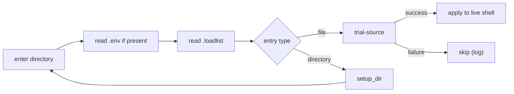

# LOADER — Layer 1: The Loader

> **Status:** Implemented.
> **Scope:** Loader algorithm, loadlist format and entry grammar, `setup_dir`, directory-local metadata, boot chain, and caching.
> **See also:** [`ARCHITECTURE.md`](./ARCHITECTURE.md) · [`MODULES.md`](./MODULES.md) · [`PACKAGES.md`](./PACKAGES.md)

-----

## 1. What the Loader Does

The loader (`zload` in `load.zsh`, `bload` in `load.bash`) reads loadlists, resolves entries to filesystem paths, and sources those paths into the running shell. `zload` is the Zsh loader; `+` is an alias for it. `bload` is the Bash equivalent.

The loader has no concept of modules or packages. It does understand directory-local loader metadata such as `.env`. Suffixed directories, prefixed directories, and prefixed-and-suffixed directories are all equally valid paths; it recurses into whichever prefixed or suffixed directories its loadlist names, without distinction. The loader trial-sources each file in a subshell before applying it to the live shell; a file that fails is skipped.

-----

## 2. Boot Chain

`profile.sh` resides in rings-root and is sourced by `.zshrc`, `.zprofile`, `.bash_profile`, and `.bashrc` (with appropriate file-safety and idempotency guards). It detects its own location, identifies rings-root, exports `$RING_ROOT`, and, for the login ring, also exports `$PROFILE_D == $RING_ROOT`.

```
.zshrc (and equivalents)
  → profile.sh     detects rings-root, exports $RING_ROOT / $PROFILE_D, invokes loader
  → loader         reads $RING_ROOT/.loadlist, recurses from there
```

`profile.sh` uses `gum` (vendored in `$LIB`) for interactive prompts during first-boot setup.

-----

## 3. Algorithm

For each loadlist the loader processes:

1. Enter the directory.
2. Read `.env` if present.
3. Read the loadlist in the current directory.
4. Resolve each entry to a filesystem path.
5. If the path is a file: trial-source it; on success, apply to the live shell.
6. If the path is a directory: call `setup_dir`, then recurse from step 1.



-----

## 4. Loadlist Format and Entry Grammar

A loadlist is a line-oriented manifest. Each non-comment, non-blank line is an entry; comments begin with `#`. The loader's parser (`io::load::read_dir`) uses the following recognition pattern to identify each entry as a valid sourceable file or recursable directory:

```
file.sh                    # sourceable file (.sh, .bash, .zsh extension)
file.zsh
file.bash
.dotfile                   # hidden file
@namespace/file.sh         # file within a prefixed directory
directory.d/               # suffixed directory — recurse
@namespace/                # prefixed directory — recurse
file.sh --quiet            # entry with per-item option
@namespace/ --defer        # directory with per-item option
```

The loader also recognizes `_` directories when they appear in loadlist entries. This is layer-1 path traversal only. Package scope is derived later by layer 3, where literal `_` segments are erased.

The grammar defines what the loader will recognize and thus traverse. Entries not matching it are ignored. Current per-item options:

| Option | Effect |
|--------|--------|
| `--quiet` | Suppress load output for this entry |
| `--silent` | Suppress all output including errors |
| `--defer` | Defer until after the boot chain completes |
| `--remote` | Fetch before sourcing |

Options are per-entry and do not propagate into recursed directories.

The loadlist format and `io::load::read_dir` grammar are prior to module and package semantics, but they are an implicit dependency: a package or module cannot be loaded outside the loader's entry grammar.

-----

## 5. `setup_dir`

When the loader enters a directory, it calls `::setup_dir`.

If `.env` exists, the loader reads it before processing that directory's `.loadlist` entries. Parse as TOML if TOML syntax is present; otherwise parse as flat `KEY=VALUE` lines. No shell evaluation occurs while reading `.env`.

If no loadlist exists, `::setup_dir` creates one by enumerating the directory's current contents per the entry grammar.

`.env` is a general directory-local metadata mechanism, not a package-root-only feature. `packages.d/@pkg/.env` is one common use, not the only one.

Contrast:

```text
aliases.d/.env
  # loader-local metadata for the aliases.d directory

env.d/@bash/env.sh
  # durable exported environment artifact belonging to @bash
```

`.env` affects how the loader enters and interprets a directory. `env.d/...` is package content that becomes part of the loaded environment.

-----

## 6. Caching

Startup files like `~/.zshrc` load `rings` modules with every interactive shell, and after a successful full load, the loader may optionally cache that traversal. Examples include `$PROFILE_D/.zshrc.cache` and `$PROFILE_D/.bash_profile.cache` for the login ring. These generated caches are a flat sequence of `builtin .` commands, one per sourced file in load order.

```sh
builtin . /absolute/path/to/file.sh &>/dev/null
```

On subsequent startups, if the cache is valid, the loader replays it directly instead of re-traversing loadlists. Deferred entries (`--defer`) appear at the end. The cache is invalidated when any loadlist is modified. It contains no logic, no conditionals, and no loader internals — it is a replay list.

-----

## 7. Planned Extensions

Two related conventions are planned as extensions to the entry grammar:

**Functional encapsulation.** Wrapping a file's contents in a single `::`-qualified function derived from the file's rings path. A functionally encapsulated file defines the function when sourced; the function is introspectable via `functions` and re-callable by name.

**Autoinvoking.** Appending `&& fn` after the closing `}` of a functionally encapsulated file-function, making sourcing the file equivalent to calling the function. Removing `&& fn` defines the function without executing it — a lightweight disable that does not require loadlist changes.

**`--run` / `-x`.** A planned per-item loadlist option. When present, the loader ensures the file is functionally encapsulated and autoinvoked before sourcing. This extends the entry grammar (§4) without changing the loader's core algorithm.

These conventions are documented in [`SHELL_STYLE_GUIDE.md`](../style/SHELL_STYLE_GUIDE.md) §1.1 and §20.12. This document does not include them in the loadlist grammar.

-----

## 8. Lossless Loadlist and Cache Behavior

Tools that rewrite `.loadlist` must preserve comments, blank lines, and original ordering. Autogenerated entries appear under `# == autogenerated ==` and are never reordered relative to user entries.

Tools that rewrite `.env` must do so atomically and emit TOML. Users may still hand-edit.

Cache files include a header containing the SHA256 of each tracked loadlist's content, plus each file's mtime at cache-write time. On startup, a cached subtree is valid if every tracked loadlist's current content hash matches the stored hash. A changed mtime with identical content does not invalidate the cache; a changed content hash always does. Only subtrees with a content-hash mismatch are re-traversed.

Structured introspection: `zload --status --json` emits `[{path, type, status, duration_ms, error}]`.

Lint: `loader::lint <dir>` validates entry syntax against the grammar in §4 — it checks that each line is a recognized entry form and that per-item options are valid. It does not check whether named paths exist on disk and it does not source any file.

-----

## 9. Layer Boundary

The loader's grammar, directory-local metadata, loadlist format, and cache precede `@core` (layer 2) and `@packages.d` (layer 3) module and package semantics, respectively.
